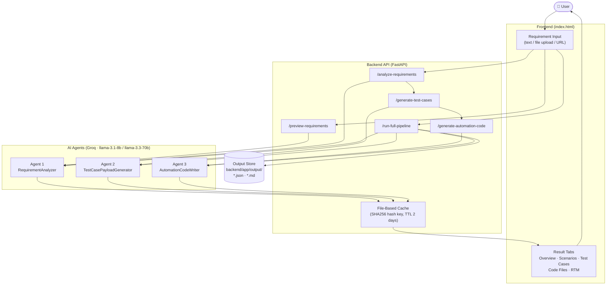
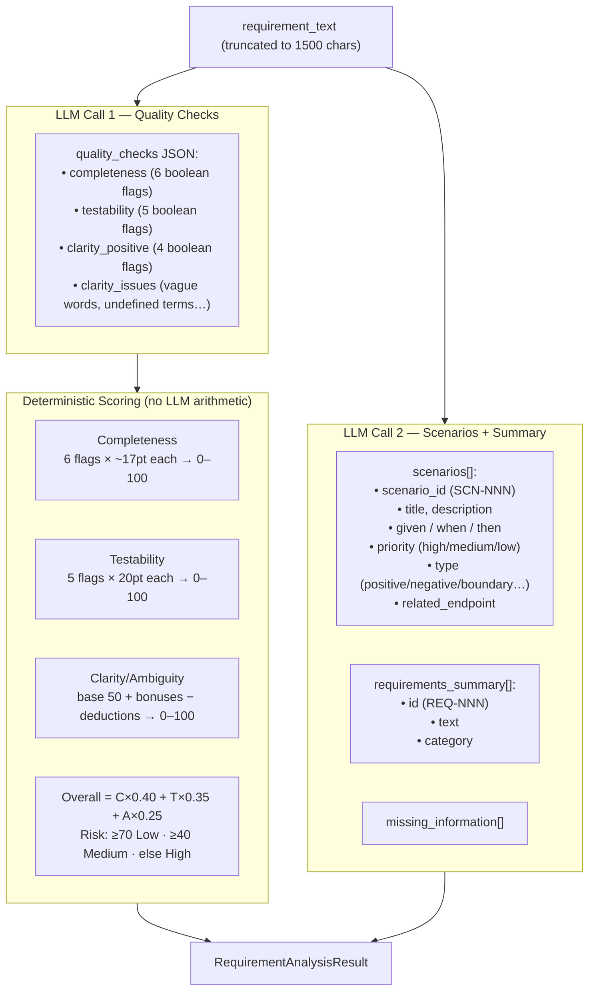
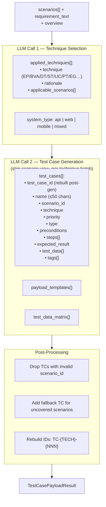
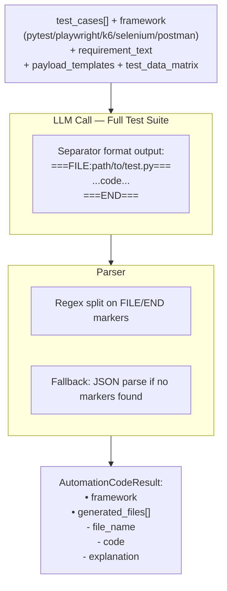
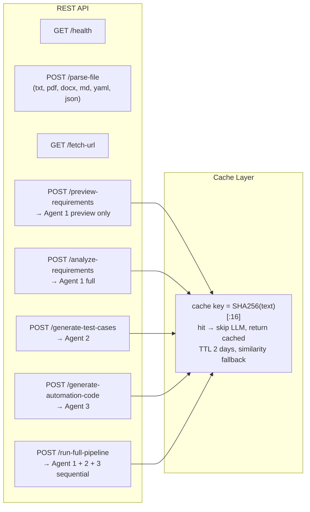

# Multi-Agent Quality Engineer — Workflow Diagram

## 1. High-Level System Overview

---

## 2. Step-by-Step Data Flow

```mermaid
flowchart LR
    REQ["📄 Requirement Text\n(≤ 8000 chars)"]

    subgraph STEP1["Step 1 — Requirement Analysis"]
        direction TB
        P1["preview-requirements\n(fast scan)"]
        A1_CALLS["LLM Call 1: quality_checks\nLLM Call 2: scenarios + summary"]
        A1_OUT["Output:\n• overview (summary, features,\n  endpoints, business_rules)\n• suggestions[]\n• quality_score (overall 0-100)\n• requirements_summary[]\n• scenarios[]\n• missing_information[]"]
    end

    subgraph STEP2["Step 2 — Test Case Generation"]
        direction TB
        P2["generate-test-cases"]
        A2_CALLS["LLM Call 1: technique selection\nLLM Call 2: test case generation\n(batched per technique)"]
        A2_VALIDATE["Grounding Validation\n• drop hallucinated scenario_ids\n• add fallback TC for uncovered scenarios\n• rebuild TC IDs: TC-TECH-NNN"]
        A2_OUT["Output:\n• system_type (api/web/mobile)\n• applied_techniques[]\n• test_cases[]\n• payload_templates{}\n• test_data_matrix{}"]
    end

    subgraph STEP3["Step 3 — Code Generation"]
        direction TB
        P3["generate-automation-code"]
        A3_CALLS["LLM Call: full test suite\n(separator format)"]
        A3_PARSE["Parse ===FILE:path===...===END===\nblocks → GeneratedCodeFile[]"]
        A3_OUT["Output:\n• framework (pytest/playwright/…)\n• generated_files[]\n  - file_name\n  - code\n  - explanation"]
    end

    ARTIFACTS[("💾 Artifacts\nfull_pipeline_output.json\nfull_pipeline_output.md")]

    REQ --> STEP1
    A1_OUT --> STEP2
    A2_OUT --> STEP3
    A3_OUT --> ARTIFACTS
```

---

## 3. Agent 1 — RequirementAnalyzer (Detail)

---

## 4. Agent 2 — TestCasePayloadGenerator (Detail)

---

## 5. Agent 3 — AutomationCodeWriter (Detail)

---

## 6. API Endpoint Map

